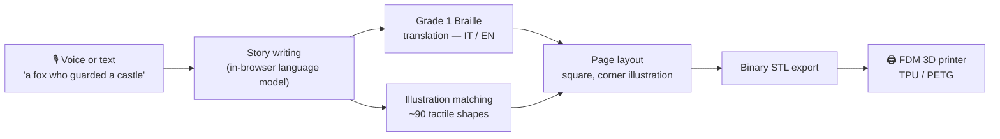
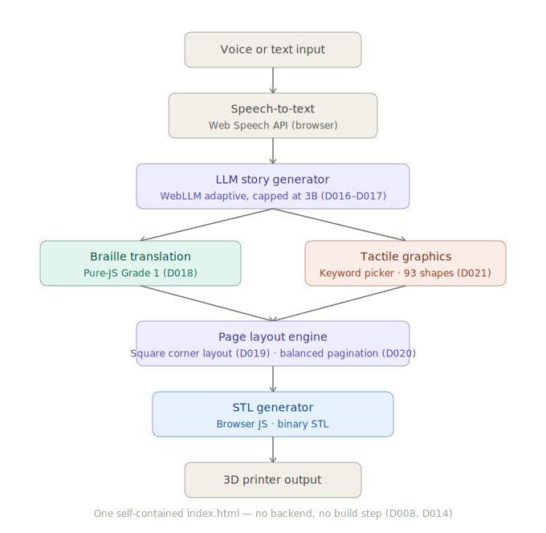
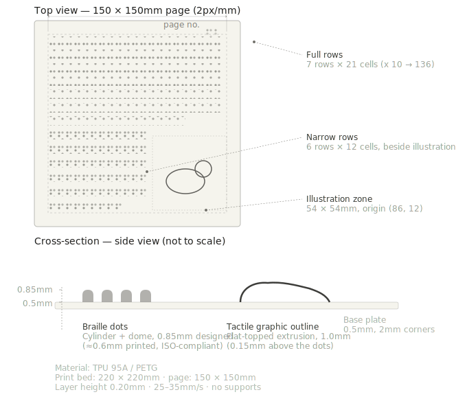
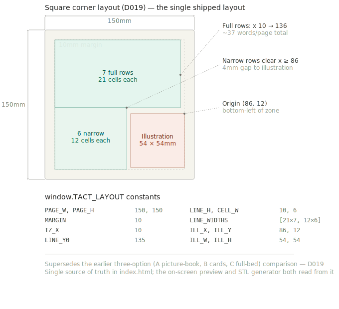

# Tact

**A story a blind child asks for, turned into a page they can read with their own hands — printed at home, on a €70 3D printer, for the cost of the filament.**

📄 The full design and engineering report — every decision, every study, every rejected alternative — lives in <a href="paper/tact.pdf"><b>paper/tact.pdf</b></a>.

---

## The gap this closes

Braille literacy among blind children has fallen from roughly **50% in 1960 to under 10% today.** The reason is not technology — it is content. A Braille book costs many times more than its print equivalent, takes weeks to produce, and only exists if someone already decided it was worth transcribing. A sighted five-year-old can ask for a story about *anything* and see it appear that evening. A blind five-year-old, in practice, cannot.

Tact exists to close exactly that gap: an idea, spoken out loud, becomes a physical Braille page with a raised tactile picture, ready to print, the same day.

---

## How it works

A parent, teacher, or the child themselves speaks a one-line idea. Everything downstream happens automatically:

The full architecture, module by module:

The result: a flexible page, roughly postcard-sized, with domed Braille dots on top and a raised silhouette in the corner — read by touch, kept, re-read, collected into a shelf of stories nobody else has. The physical realization of that page, top view and cross-section, is shown below:

---

## What's actually interesting here

A few decisions this project made on purpose, because the obvious version of this tool would have failed the people it's for:

**The story-writing model runs inside the visitor's browser tab — no server, no API key, no account.** Tact loads a small language model over WebGPU and generates the story entirely on the reader's own device. The app profiles the device at runtime and steps down through a tier list — from a 3-billion-parameter model on capable hardware to progressively lighter ones — so nobody is locked out by their laptop, and on that path nothing leaves their machine. A faster hosted path now runs ahead of it and sends only the one-line idea, returning a story in under a second; it uses two independent providers so neither can take it down, and removing it from the configuration returns the app to browser-only generation. If the device has no GPU at all, the pipeline doesn't fall back to a canned demo: it takes the words the person actually spoke or typed and turns *those* into real Braille and a real tactile page. Every visitor gets a working product; the model is a bonus, not a dependency.

**Braille translation is a from-scratch deterministic mapping, not a bundled library.** Grade 1 Braille — the uncontracted form this project standardizes on for beginning readers — is a fixed character-to-cell table with no linguistic ambiguity. Tact implements it directly for Italian and English rather than shipping a general-purpose translation engine, which means it is instant, works fully offline, and has no failure mode where a translation silently comes back wrong.

**The on-screen preview and the physical print are generated from the same geometry, in millimetres, from one source of truth.** There is exactly one object describing where every Braille dot and every illustration pixel sits on the page. The browser preview renders it as scalable vector shapes; the STL exporter walks the same coordinates into 3D domes and pillars. What a parent sees on screen before printing is what comes out of the nozzle — not an approximation of it.

**Page filling is balanced, not greedy.** A naive paginator fills page one to the brim and dumps whatever's left onto a mostly-empty page two. Tact instead finds the split that leaves every page evenly full, and tunes how much the story-writing model produces so a two-page story actually reads as two full pages — because a blind child holding a page that's ninety percent blank knows exactly what that feels like, and it isn't a small thing.

**The tactile shape library is hand-drawn, not clip art.** Roughly ninety line-art illustrations — animals, fairy-tale figures, everyday objects, weather and sky — built specifically to survive being scaled down, extruded to under a millimetre, and read by fingertips rather than eyes. Illustrations are matched to a story by whole-word keyword search across Italian and English, covering plurals and diminutives, so "a *lupo*" and "a *wolf*" both correctly summon the same wolf.

**Everything is free, permanently, by construction — not as a pricing tier.** No step in the pipeline has a paid-only path: speech recognition, story writing, Braille translation, illustration, and the 3D file itself are all computed locally or via technology with no usage cost. The only recurring expense is the plastic.

---

## Try it now

Open `index.html` in any modern desktop browser. Nothing to install, nothing to configure, no account, no server.

1. Tap the microphone (or type) and describe a story in one sentence — Italian or English.
2. The page composes a short story, translates it to Grade 1 Braille, and picks a matching tactile illustration.
3. Preview the square page — Braille dots and illustration, true to the size it will print at.
4. Download the `.stl` file and slice it for TPU or PETG on any FDM printer with a 220 × 220 mm bed.

No sign-up, and no single point of failure: the hosted model is an accelerator, not a dependency. Switch it off and the app writes stories in the browser; switch that off too and the reader's own words still become a real Braille page. A family that has the file keeps a working tool.

---

## Braille standards

Every dimension follows **ISO 17049:2013** (the Marburg Medium standard), over-built by roughly 30% in height to compensate for the shrinkage FDM printers consistently introduce:

| Parameter | Standard target | Notes |
|---|---|---|
| Dot diameter | 1.3 – 1.6 mm | domed profile, never flat |
| Dot height (printed) | 0.7 – 0.9 mm | over-designed from the 0.5mm paper spec |
| Dot spacing (within a cell) | 2.5 mm center-to-center | |
| Cell spacing | 6.0 mm center-to-center | |
| Line spacing | 10.0 mm center-to-center | |

Italian output is **Grade 1 only** — Italian Braille has no contracted form, so this is the correct default rather than a simplification. English defaults to **UEB Grade 1**, the form used for beginning readers before contractions are introduced.

## Bilingual by design

Italian and English are both first-class from the first commit — not a default language with a translation bolted on. The developer is based in Milan, Italy, and the first real-world partners this project intends to reach are Italian: the Biblioteca Italiana per i Ciechi "Regina Margherita," the Istituto dei Ciechi di Milano, and UICI Lombardia. English exists so the same tool is useful everywhere else on day one.

---

## Hardware

Built around **budget FDM printers** (roughly €50–100 — an Ender 3 clone, a Kingroon KP3S, an Elegoo Neptune) rather than a purpose-built Braille embosser, because:

- A printed TPU or PETG page survives years of small hands, bending, and washing; embossed paper does not.
- The same €70 device that prints a page can also print a phone stand or a toy — no single-purpose hardware purchase required.
- Recycled PET filament brings the marginal cost of a page close to zero.
- Families and classrooms are far more likely to already own, or be able to justify, a general-purpose 3D printer than a specialized embosser costing three to five times as much.

---

## Tech stack

| Layer | Technology | Why |
|---|---|---|
| Interface | Single-file HTML + a component-based UI, no build step | opens from disk, deploys as a static file, nothing to compile |
| Speech input | Browser speech recognition | native, free, no key |
| Story generation | Two hosted models behind a key-holding proxy, then an in-browser model over WebGPU, then the reader's own words | under a second on any device, and still works when the cloud does not |
| Braille | Hand-implemented Grade 1 tables, IT + EN | deterministic, offline, auditable |
| Illustration | ~90 hand-drawn SVGs, whole-word bilingual matching | tactile-legible, not decorative clip art |
| Page geometry | One shared coordinate system (mm) for preview and export | preview matches print, exactly |
| 3D export | Hand-rolled binary STL writer | no dependency, full control over dot and pillar geometry |
| Hosting | Static file, any web host or none at all | works from `file://`, zero infrastructure |

---

## Status

- [x] Research on audience, standards, and prior art
- [x] Full pipeline running end-to-end, client-side
- [x] In-browser story generation with adaptive model selection and a real (non-demo) offline fallback
- [x] Grade 1 Braille translation, Italian and English
- [x] True-to-scale page preview and matching binary STL export
- [x] ~90-shape hand-drawn tactile illustration library
- [ ] Independent testing with blind and low-vision readers
- [ ] Partnership conversations with Italian accessibility organizations
- [ ] Optional command-line version for batch/offline use

---

## License

MIT — free to use, fork, and adapt, including for schools, libraries, and nonprofit organizations. No attribution required, though it's always welcome.

## Organizations this project intends to reach

- Biblioteca Italiana per i Ciechi "Regina Margherita" — Monza
- Istituto dei Ciechi di Milano
- UICI Lombardia (Unione Italiana dei Ciechi e degli Ipovedenti)
- Lega del Filo d'Oro — for the deafblind community, for whom Braille is often the only channel

---

## Related work

**[tatto.dev](https://github.com/francescogiuliani87/tatto.dev)** — by **Francesco Giuliani**

An independent fork that rebuilt Tact as a production web application. It replaces the in-browser language model with a fast server-side one, so a story arrives in seconds on any device with no model download; cuts the JavaScript payload by roughly 94%; moves the codebase to TypeScript with a modular architecture and unit tests on the Braille tables; adds SEO infrastructure, a reader mode and a responsive navigation; and fixes a bug where the Italian toggle still produced English stories.

The idea of reaching a language model over the network, rather than downloading one into the browser, comes from that work and is the reason Tact now offers the same option. The two projects share no code and evolve independently.

---

Built on one conviction: a blind child's imagination shouldn't be limited by what a publisher already decided was worth printing.

